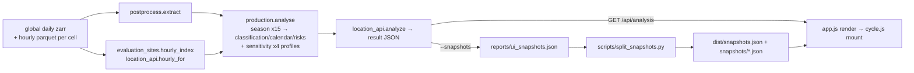

<!-- Research scout report (CodeAudit), generated 2026-09-21 for the future plan. Read-only literature/code research; claims marked [unverified] are not confirmed. -->

# Engineering scout: Global Blueberry Recommendation

## 1. Findings

### Architecture

- **Where constants live:** `production.PROFILES` (production.py:24-52); derived profiles by dict-merge. Risk list `EVENTS` (67-72), metric schema `STAGE_METRICS` (59-65) plus a parallel `needs`/`reasons` map inside `season()` (~277-290), plus a hard-coded unranked list in `risks()` (~411). The UI re-declares stage→event mapping (`cycle.js` `stages`, one `event` per lane) and per-stage metric labels/units (`metricsFor`). Adding a metric today touches 4 Python tables + `season()` + `cycle.js metricsFor` + optionally the app.js per-winter table; adding a ranked risk touches `EVENTS`, the if-ladder in `risks()`, `cycle.js stages/laneSummary/detail eventTitle`.
- **JSON contract (implicit, undocumented):** top level `site, annual[15], monthly[180], climatology, soil[], production, hourly_source, method_version, provenance, hourly_sha256, weather_content_sha256, analysis_id`. `production` = `status|reason` or `{profile, assumptions, hemisphere, years, status_counts, chill_hours, freeze_hours, classification{per_year, mean_based, chill_only, multi_feature}, calendar{anchor, <offset>{n, mean, median, p10, p90, *_date}}, risks{ranked[], unranked_exposures{}, note}, seasons[15]{status, chill_*, flowering/fruit/harvest [a,b], offset_days, metrics, issues}, sensitivity, changes, limitations, scope}`. Consumers: app.js, cycle.js, split_snapshots.py, tests. No schema file, no version gate on the frontend (`method_version` is displayed only).
- **Two operating modes** (UI_RUNBOOK): hosted static snapshot (no API) and connected local (SSH tunnel + `preview-ui.mjs` proxy → loopback Python `http.server`). Single global `BUSY` lock → 503 for concurrent requests; frontend 90 s abort.

### Test coverage by module (79 backend tests, unittest, all synthetic fixtures)

| Module | Tests | Covered | Untested |
|---|---|---|---|
| production.py | 18 | season chain/dates, chill definitions, missingness, suspect rain, classification, risks order/denominators, wilson, analyse | `calendar()` date reconstruction, `sensitivity()`, `render()`, `run()`, south-hemisphere season end-to-end |
| location_api.py | 6 | summarize, avg, production_block, LandMask null-island | `analyze()` assembly, `known_sites`, `Handler` (status codes, busy lock), `--snapshots`, analysis_id determinism |
| evaluation_sites.py | 4 | cell_key, hourly_for reuse/sharing/tamper, incomplete index | `registry()` pin-mismatch guard, `fetch()` |
| postprocess.py | 0 direct | (LandMask via API tests) | `extract()`, provenance/screening, `global_report`, `demos` |
| evidence_report.py | 6 | complete, chill, dry_spell | build() |
| chill_comparison.py | 0 | — | `chill_portions()` (needed for change e) |
| pilot.py / global_daily.py | 9 + 10 + 3 | units, QC, retry/recovery, locks | — |
| stage_scenarios / reconcile / soil / stations / observations | 7+3+6+3+4 | as named | — |
| scripts/split_snapshots.py | 0 | — | grouping, field allow-list |
| dist/app.js, cycle.js, preview-ui.mjs | 0 | `node --check` only | everything: model(), interval math, risk rendering, race guard |

### Fragility and global-scale breakers

1. **Server-only paths:** `ROOT='/media/fpt/fpt2/Weather_Claude'` (postprocess.py:27, also discover); `Downloads.safe_space` requires mount `/media/fpt/fpt2` (pilot.py); port 8787 in API, proxy and runbook. Nothing runs end-to-end off-server; `config/`, `state/`, `reports/` are absent locally.
2. **Preset whitelist hides new regions:** `app.js:28 presets()` iterates `['Reference','Georgia','Central Florida','South Florida']`; `split_snapshots.py` assigns `'Panel'` or the site region. A Chilean or Brazilian panel site would be written to disk and never shown. Boot also hard-codes Papanduva's coordinates (app.js:54).
3. **Hard-coded panel:** `evaluation_sites.PANEL` is a Python literal; `registry()` raises if a pilot pin drifts. Global sites need a data file.
4. **No cache, heavy request:** each `/api/analysis` re-reads zarr, loads the land mask on first call, runs `analyse` 5× (primary + 4 sensitivity profiles) × 15 winters; identical pins in one cell recompute. `known_sites()` re-reads JSON per request.
5. **Error mapping:** `Handler` maps any `ValueError/KeyError/IndexError` inside `analyze()` to 400 "Invalid coordinate input" — a missing `config/sites.json` key becomes a user error. 500 and 503 collapse to one UI message (app.js:27); busy is indistinguishable from offline. No server-side timeout.
6. **Duplicated logic:** `haversine_km` (location_api) vs `km_distance` (postprocess); chill windows and definitions differ between `summarize()` (0–7.2 °C, Nov–Mar / May–Sep) and production (`<7.2`, Nov–May / Apr–Oct) — the "Chill" card and the production packet report different quantities under one word; `esc/escape`, `fmt/number`, `good/finite`, chill-label mapping duplicated across app.js and cycle.js (chill label appears twice inside app.js alone).
7. **Hemisphere/tropics:** `hemisphere()` puts lat 0 north; tropical sites will return `chill_not_met` every winter → `classification` valid but `Evergreen`; ruler declines. Acceptable, but no explicit "no winter" state.
8. **index.html** has a duplicated `<html><head>` block (lines 1–2).
9. **Snapshots:** 18 files × 51–64 KB (~1 MB total) loaded lazily; index ~300 B/site. Fine to several hundred sites; `monthly[180]` is the bulk. Not a page-load problem now.
10. **Missing states:** no partial-production state (hourly present but a stage missing is only visible per winter); tunnel/pots selection is a note only; no "job pending" state; ocean pin returns 200 with `error` key.

## 2. Recommendations, slotting and hours

### Planned changes

| # | Change | Where it slots | Hours |
|---|---|---|---|
| a | Risk gating | `production.risks()`: add per-EVENT `stage` and window rule; profile keys `risk_min_frequency` (0.5) and `risk_min_years`; emit `ranked[]` + `demoted[]` with `reason ∈ {stage_outside_window, below_threshold, insufficient_years}`. Overlap: risk fixed window (e.g. warm mid-winter) vs site window = calendar p10 start…p90 harvest end. UI: app.js risk table split; cycle.js `laneSummary/detail` must look up `ranked ∪ demoted`. Tests in test_production `SummaryTests`. | 10–12 |
| b | Rank disease days | Two EVENTS (`flowering_disease`, `harvest_disease`) with `disease_event_min_days` threshold (≥1 is near-certain in humid sites); cycle.js `stages` needs `events[]` per lane instead of one `event`. | 5–6 |
| c | New metrics | Each: `STAGE_METRICS` + compute in `season()` + `needs` + cycle.js `metricsFor` + test. Pollination-unfavourable (Tmax<15 & rain<1 in flowering) 2 h; berry-stage freeze (Tmin≤0 over `fruit`) 1.5 h; stage dry spell via `evidence_report.dry_spell` per stage 2 h; warm mid-winter hours: `winter` hourly slice already in `season()` (mid-Nov–mid-Feb north / mid-May–mid-Aug south) 2 h; daily fallback only meaningful for non-hourly pins, so put it in `location_api.summarize` as an annual field (Tmax>21 days) 2 h; snapshot regen + docs 2 h. | 12 |
| d | Planting window | `season()` computes `planting=[a,b]` or `no_valid_establishment_window`; extend `OFFSETS` with `planting_start/_end` so `calendar()` picks it up; cycle.js `stages` gets a `planting` lane + `interval()` case; app.js per-winter table column. Rule itself must come from Paul's R §11/§15 (single window) — human decision. | 6–8 + decision |
| e | Dynamic Model profile | Move `chill_comparison.chill_portions` into production (or `chill.py`); generalise `chill_flags` → `chill_increments(temps, definition)` (bool→float; CP deltas) so `np.cumsum ≥ requirement` still works; profile `dynamic_cp_v1` with `chill_requirement` in CP and CP-scaled `evergreen/deciduous` class thresholds; rename `chill_hours`→`chill_units` + `chill_unit` in the packet; UI unit labels ('h') in app.js/cycle.js/sensitivity table. Known-value tests against chillR. | 10–12 + decision |
| f | On-demand hourly for a pinned cell | `evaluation_sites.acquire_cell(root, lat, lon)` reusing `Source('met_hourly').point` with id `CELL_<ilat>_<ilon>`, scope `ondemand`, `save_point`, then `hourly_index` rebuild; must run under the flock and `Downloads` limits; minutes-long, so requires (g). Authorisation gate per project constraint. | 8–12 |
| g | Durable job/cache | Separate `state/analyses.sqlite` (plan forbids reusing acquisition schema): jobs keyed by (cell, profile, `METHOD`, code sha) with lease/attempts; results as JSON under `reports/cache/`; `POST /api/analyses`→202 id, `GET /api/analyses/{id}`; in-process worker thread; frontend polling with backoff; restart test. | 16–24 |
| h | Auth for hosting | Do not expose `http.server`. Reverse proxy (Caddy/nginx) with TLS + basic/forward auth in front of static + API, coordinates redacted in logs; or FastAPI port with bearer token. Needs deployment authorisation. | 8–16 + decision |

### Refactor list (value/effort, descending)

1. **Data-driven preset groups** (app.js:28) — 0.5 h. Blocks global sites today.
2. **Metric/risk registry**: one table `(name, stage, inputs, compute, event_rule, label, unit)` consumed by `season()`, `risks()`, `needs`, and exported as `production.metric_catalog` so cycle.js `metricsFor`/app.js stop hard-coding labels — 8–10 h. Makes a, b, c, d each ~30 % cheaper; do first.
3. **Typed result schema**: `TypedDict`/dataclass + `docs/weather/analysis_schema.json`, validated in `test_location_api` and by `split_snapshots.py`; bump `METHOD` — 6–8 h.
4. **Configurable ROOT/port** via env (`WEATHER_ROOT`, `WEATHER_API_PORT`) with fixture root for tests — 2 h. Enables local end-to-end runs.
5. **Split production.py** into `production/{profiles,season,summary,report}.py`; migrate imports in location_api/tests — 4–6 h.
6. **API hardening**: exception mapping (only coordinate parse → 400), server timeout, 503 vs 500 distinguished in UI — 3 h.
7. **Frontend modules**: `util.js` shared helpers, `production-view.js`, ES modules; `node:test` for `CycleView.model`, gating display, race guard — 8–10 h.
8. **Per-cell result cache** (subset of g) — 3–4 h.
9. **Unify chill card vs production chill** (one helper, one window) — 2 h + decision.
10. Snapshot pagination — not needed (<1 MB, lazy); revisit past ~500 sites — 0 h.

## 3. Effort (person-days, one builder + AI assistance, 6 productive h/day)

| Item | Days |
|---|---|
| Refactors 1, 4, 6 (prerequisites) | 1 |
| Refactor 2 registry + 3 schema | 2.5 |
| a gating | 2 |
| b disease ranking | 1 |
| c four metrics | 2 |
| d planting window | 1.5 |
| e Dynamic Model profile | 2 |
| Refactors 5, 7 | 2.5 |
| g jobs/cache | 3–4 |
| f on-demand hourly | 2 |
| h auth + hosted deployment | 2–3 |
| Snapshot regen, runbook/changelog per batch | 1 |
| **Total** | **≈ 23–25** |

## 4. Risks, unknowns, decisions

- **Human decisions:** gating threshold and "overlap" definition (fixed-window risks vs calendar-derived stages); disease event day threshold; planting rule (single window from R); CP requirement and CP class thresholds; which chill quantity the top card shows; authorisation for on-demand acquisition and any deployment.
- **Unknowns:** live request latency (5× analyse per call, unmeasured); whether `fetch()`'s zarr chunk caching keeps arbitrary global cells within the 200 GiB/500 GiB limits [unverified]; Chromium-only export verification.
- **Risks:** renaming `chill_hours` (e) breaks every consumer without the schema step; hourly fallback for warm-winter hours invites daily-derived chill by analogy — keep it in the annual context only; tropical pins yield structurally empty production packets; hosted snapshot and live API can drift if `METHOD` is not enforced in the frontend.
- **Cross-topic:** metric formulas and thresholds are the science scout's call; this report only fixes their insertion points.
